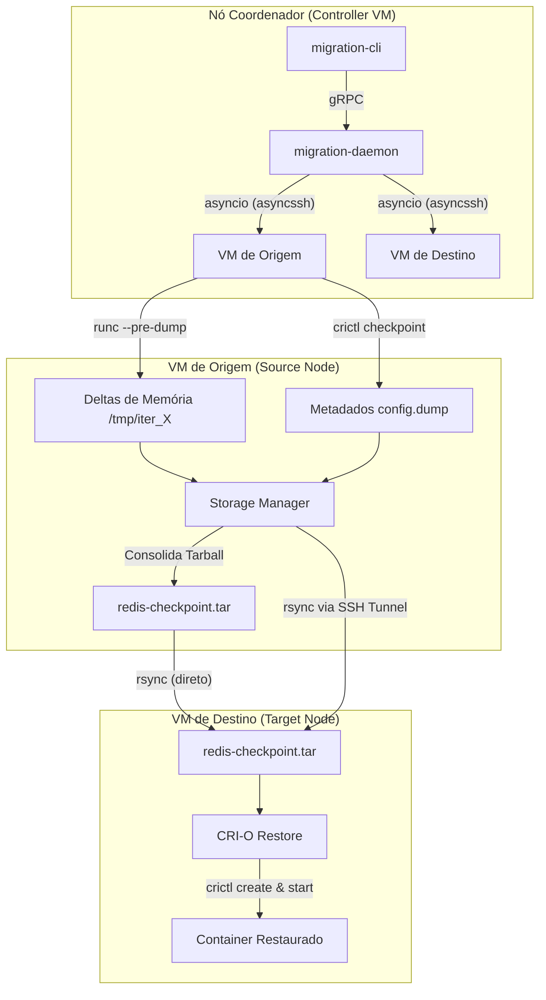

# Base de Conhecimento - Migração de Contêineres (CRI-O / CRIU / GCP)

Bem-vindo à base de conhecimento do projeto de Migração de Contêineres. Este diretório centraliza toda a documentação técnica, decisões de arquitetura e guias passo a passo desenvolvidos ao longo do projeto.

---

## 🗺️ Mapa de Documentação

Para facilitar a leitura e o onboarding de novos desenvolvedores, a documentação está organizada de forma lógica nos seguintes arquivos:

1. [📂 01. Olá Mundo - Redis no CRI-O](file:///home/matheus/Documents/master-usp/migration/docs/01-hello-world-redis-crio.md)
   * Comandos fundamentais para download de imagem, criação de pods sandbox, instanciar e inicializar contêineres utilizando a especificação do CRI-O (`crictl`).
2. [📂 02. Checkpoint & Restore Básico](file:///home/matheus/Documents/master-usp/migration/docs/02-checkpoint-restore.md)
   * Fluxo manual básico para capturar o estado de um contêiner ativo, exportar o tarball, remover o contêiner/pod antigo e restaurá-lo em um novo pod.
3. [📂 03. Checkpoint Iterativo Incremental (Pre-dump)](file:///home/matheus/Documents/master-usp/migration/docs/03-iterative-checkpoint.md)
   * Guia detalhado de como executar checkpoints iterativos incrementais para diminuir o tempo de parada (downtime). Explica o problema de isolamento de namespaces e como superá-lo com links simbólicos relativos internos.
4. [📂 04. Infraestrutura GCP (Terraform & Packer)](file:///home/matheus/Documents/master-usp/migration/docs/04-gcp-infrastructure.md)
   * Detalhamento técnico da infraestrutura na nuvem: topologia de rede VPC, VMs do cluster, geração de imagens Debian 13 otimizadas para CRI-O/CRIU via Packer (incluindo patches de AppArmor e CNI) e provisionamento automático do orchestrator.
5. [📂 05. Orquestrador de Migração (Python gRPC + CLI)](file:///home/matheus/Documents/master-usp/migration/docs/05-migration-orchestrator.md)
   * Arquitetura de software do orquestrador assíncrono: Daemon em background gRPC, CLI de controle, máquina de estados assíncrona baseada em `asyncio`/`asyncssh`, geração automática do tarball autocontido e transferência via `rsync`.
6. [📂 06. GCP Image Manager CLI](file:///home/matheus/Documents/master-usp/migration/docs/06-gcp-image-manager-cli.md)
   * Documentação do utilitário interativo CLI desenvolvido em Node.js e TypeScript para limpeza e gerência de imagens customizadas antigas e órfãs no Google Cloud.
7. [📂 07. Guia de Validação em Ambiente Real - Migração Interativa](file:///home/matheus/Documents/master-usp/migration/docs/07-validation-guide.md)
   * Roteiro passo a passo detalhado para testar e validar o fluxo completo de migração de contêineres interativa e incremental de ponta a ponta em um ambiente composto por 3 VMs (1 controladora e 2 nós).

---

## 🏛️ Arquitetura do Sistema

O ecossistema do projeto está estruturado em torno do seguinte fluxo de controle e execução:

### Componentes Principais

* **Orquestrador Central**: Escrito em Python utilizando programação assíncrona (`asyncio`). Ele remove a necessidade de ferramentas complexas (como Kubernetes) ao rodar diretamente na API do CRI-O.
* **CRI-O & runc**: O CRI-O atua como o Container Runtime Interface (CRI) de alto nível, enquanto o `runc` executa as chamadas de baixo nível para realizar os pre-dumps interativos, conversando diretamente com a engine do kernel Linux (CRIU).
* **CRIU (Checkpoint/Restore in Userspace)**: A engine central que congela e descongela os processos copiando as páginas de memória de forma eficiente.
* **GCP VMs**: As máquinas virtuais rodam sobre imagens Debian 13 geradas pelo Packer, contendo todas as dependências pré-instaladas, sanitizadas e livres de incompatibilidade com o AppArmor.

---

## 🚀 Como Iniciar

1. Para entender a lógica de infraestrutura e provisionar o ambiente na nuvem, leia a documentação de [GCP Infrastructure](file:///home/matheus/Documents/master-usp/migration/docs/04-gcp-infrastructure.md).
2. Para explorar o funcionamento manual da migração na VM, siga o [Iterative Checkpoint Guide](file:///home/matheus/Documents/master-usp/migration/docs/03-iterative-checkpoint.md).
3. Para entender ou estender o orquestrador automatizado, consulte [Migration Orchestrator](file:///home/matheus/Documents/master-usp/migration/docs/05-migration-orchestrator.md).
4. Para validar a migração interativa passo a passo no seu cluster, siga o [Guia de Validação em Ambiente Real](file:///home/matheus/Documents/master-usp/migration/docs/07-validation-guide.md).
